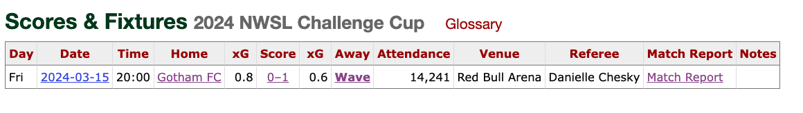

# Assets Directory

Static assets for the NWSL Analytics project.

## Organization

### Tournament Logos (`tournament-logos/`)
Official logos and graphics for NWSL tournaments:
- Challenge Cup logos (2020-2024)
- Fall Series graphics
- Competition branding assets

### Documentation Images (`documentation-images/`)
Images and graphics used in documentation:
- Technical diagrams
- System architecture visuals
- Analytics examples and screenshots

## Usage

### In Documentation
Reference assets using relative paths:
```markdown

```

### In MkDocs
Assets can be referenced in documentation:
```markdown

```

## File Naming Conventions

### Tournament Assets
- Format: `YYYY-tournament-name.ext`
- Example: `2024-challenge-cup.png`

### Documentation Assets  
- Format: `descriptive-name.ext`
- Example: `system-architecture.webp`

## Supported Formats
- **PNG**: For logos, diagrams, and graphics requiring transparency
- **WEBP**: For web-optimized images and documentation
- **SVG**: For scalable graphics (preferred for diagrams)

## Adding New Assets

1. **Choose appropriate directory** based on asset type
2. **Follow naming conventions** for consistency
3. **Optimize file size** for web delivery
4. **Update documentation** to reference new assets
5. **Consider accessibility** - provide alt text in usage

## Asset Guidelines

- **File Size**: Keep under 1MB for web performance
- **Resolution**: Use appropriate resolution for intended use
- **Accessibility**: Provide meaningful alt text
- **Copyright**: Ensure proper licensing for all assets