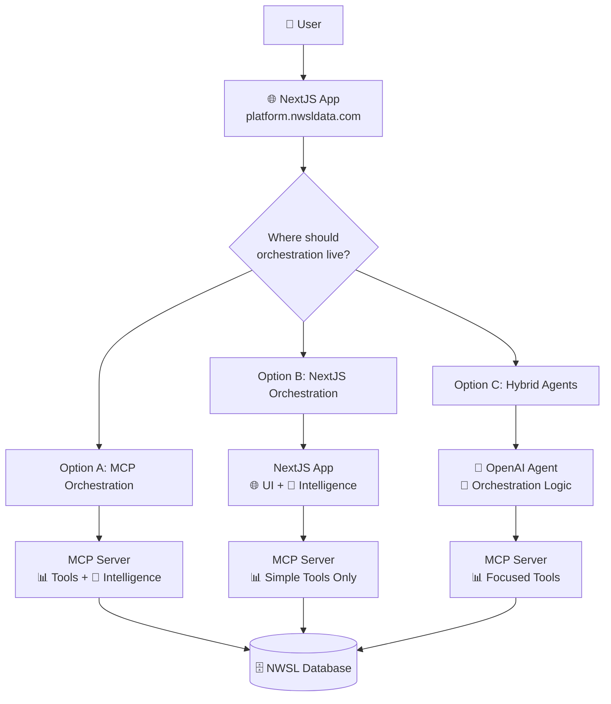

```mermaid

graph TB
      User[👤 User] --> NextJS[🌐 NextJS App<br/>platform.nwsldata.com]

      NextJS --> Choice{Where should<br/>orchestration live?}

      Choice --> A[Option A: MCP Orchestration]
      Choice --> B[Option B: NextJS Orchestration]
      Choice --> C[Option C: Hybrid Agents]

      A --> MCP_Complex[MCP Server<br/>📊 Tools + 🧠 Intelligence]
      MCP_Complex --> DB[(🗄️ NWSL Database)]

      B --> NextJS_Complex[NextJS App<br/>🌐 UI + 🧠 Intelligence]
      NextJS_Complex --> MCP_Simple[MCP Server<br/>📊 Simple Tools Only]
      MCP_Simple --> DB

      C --> Agent[🤖 OpenAI Agent<br/>🧠 Orchestration Logic]
      Agent --> MCP_Tools[MCP Server<br/>📊 Focused Tools]
      MCP_Tools --> DB

```