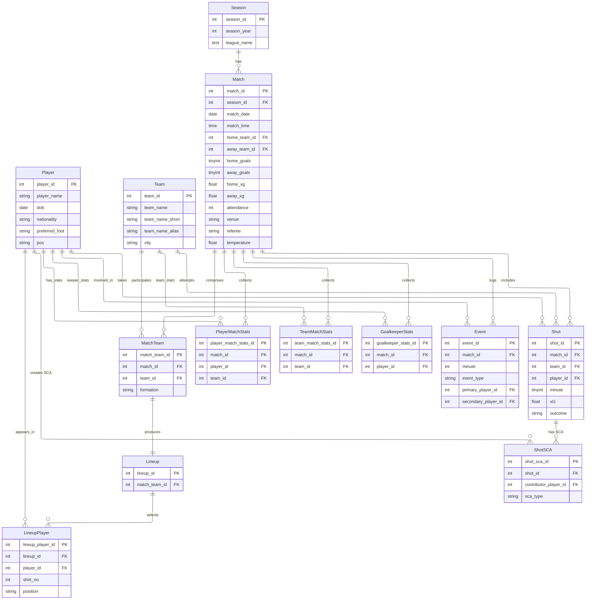

```mermaid
---
config:
    layout: elk
    properties:
        nodePlacementStrategy: "LINEAR_SEGMENTS"
---

erDiagram
%% === core dimensions ===

    Season {
        int     season_id   PK
        int    season_year
        text    league_name
    }

    Player {
        int    player_id PK
        string player_name
        date   dob
        string nationality
        string  preferred_foot
        string  pos
    }
    
    Team {
        int    team_id         PK
        string team_name
        string team_name_short
        string team_name_alias
        string  city
    }

    Match {
        int      match_id      PK
        int      season_id     FK
        date     match_date
        time    match_time
        int      home_team_id  FK
        int      away_team_id  FK
        
        tinyint home_goals
        tinyint away_goals
        float   home_xg
        float   away_xg

        int      attendance
        string   venue
        string  referee
        float   temperature
    }

%% === match participation ===

    MatchTeam {
        int match_team_id PK
        int match_id      FK
        int team_id       FK
        string formation
    }

    Lineup {
        int lineup_id PK
        int match_team_id FK 
    }

    LineupPlayer {
        int lineup_player_id PK
        int lineup_id  FK
        int player_id  FK
        int shirt_no
        string position
    }

%% === per-match stats ===

    PlayerMatchStats {
        int player_match_stats_id PK
        int match_id   FK
        int player_id  FK
        int team_id    FK
    }

    TeamMatchStats {
        int team_match_stats_id PK
        int match_id FK
        int team_id  FK
    }

    GoalkeeperStats {
        int goalkeeper_stats_id PK
        int match_id FK
        int player_id FK
    }

%% === events & shots ===

    Event {
        int  event_id PK
        int  match_id FK
        int  minute
        string event_type          
        int  primary_player_id FK
        int  secondary_player_id FK
    }

    Shot {
        int  shot_id PK
        int  match_id FK
        int  team_id  FK
        int  player_id FK
        tinyint minute
        float xG
        string outcome
    }

%% === bridge table for shot-creating actions ===

    ShotSCA {
        int  shot_sca_id PK
        int  shot_id     FK
        int  contributor_player_id FK
        string sca_type         
    }

    %% === relationships ===
    Season ||--o{ Match : has
    
    Player ||--o{ LineupPlayer       : appears_in
    Player ||--o{ PlayerMatchStats   : has_stats
    Player ||--o{ GoalkeeperStats    : keeper_stats
    Player ||--o{ Event              : involved_in
    Player ||--o{ Shot               : takes

    Team   ||--o{ MatchTeam          : participates
    Team   ||--o{ TeamMatchStats     : team_stats
    Team   ||--o{ Shot               : attempts

    Match  ||--o{ MatchTeam          : comprises
    Match  ||--o{ PlayerMatchStats   : collects
    Match  ||--o{ TeamMatchStats     : collects
    Match  ||--o{ GoalkeeperStats    : collects
    Match  ||--o{ Event              : logs
    Match  ||--o{ Shot               : includes

    MatchTeam ||--|| Lineup          : produces
    Lineup ||--o{ LineupPlayer       : selects
    Shot ||--o{ ShotSCA              : "has SCA"
    Player ||--o{ ShotSCA            : "creates SCA"

```